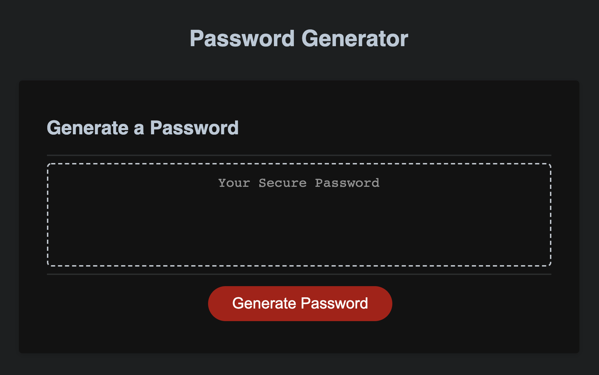

# Password Generator Starter Code

The HTML and CSS was supplied by a third party. The goal of the project was to create the logic for the password generator using Java Script. 

## Layout of Application 

## Structure of JS

I puedo coded a majority of the logic throughout the script via //comments. There are many different approaches to making a randomized generator. For this project, I decided to use a Master Array to collect the information from the user and then generate random chracters based on the chosen peramiters. If user choses invalid answers:  

## Tl;DR
*Take your time understanding the fundemtnals of JS before hoping into huge projects. It will save a lot of downtime from reaseaching ansers. 

*Manually inputting the elemtns into the Arrways for this project was not pleasnt.Make sure to log and reuse huge blocks of code.
